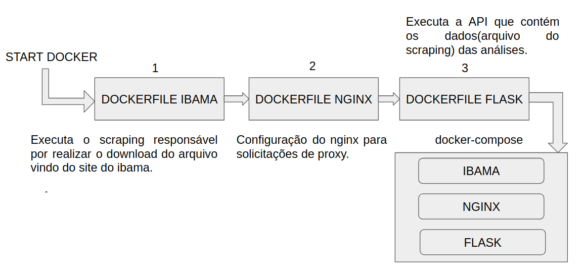

## Análise dos locais que foram afetado por manchas de óleo, de acordo com dados do [IBAMA](http://www.ibama.gov.br/manchasdeoleo-localidades-atingidas)

#### Esse projeto é uma parte melhorada do seu estado original desenvolvido no repositório de [Karinne Cristina](https://github.com/karinnecristina/Aplicacao_web)

### Como rodar o projeto

```
$ git clone https://github.com/igobarros/app-ibama.git
$ cd app-ibama
$ docker-compose up --build
```

### Estrutura do projeto

```bash
.
├── docker-compose.yml
├── flask
│   ├── app
│   │   ├── __init__.py
│   │   └── views.py
│   ├── app.ini
│   ├── Dockerfile
│   ├── requirements.txt
│   ├── run.py
│   └── volume
├── ibama
│   ├── Dockerfile
│   ├── files
│   ├── links.txt
│   ├── requirements.txt
│   ├── scraping.py
│   └── settings.py
├── nginx
│   ├── Dockerfile
│   └── nginx.conf
├── README.md
└── volumes

7 directories, 15 files
```




Por de baixo dos panos, serão construidos 3 containers docker sendo orquestrados pelo docker-compose. O primeiro container scraping, responsável por realizar o download do arquivo que será extraído as informações para análises. No segundo container, do flask, será responsável por ler a base de dados e disponilizar por API via requisições HTTP em json. Por último, temos o terceiro container que é responsável pelas requisições da API desenvolvida com flask.

### Comandos úteis de docker-compose

Subindo os containers com um único comando!

```bash
$ docker-compose up
```

Parando os containers com um único comando!

```bash
$ docker-compose down
```

Reinicializando os containers com um único comando!

```bash
$ docker-compose restart
```

Exibindo os serviços que estão em execução com um único comando!

```bash
$ docker-compose ps
```

Exibindo os serviços que estão parados com um único comando!

```bash
$ docker-compose ps -a
```

Entrar dentro de um container

```bash
$ sudo docker exec -it <image_name> /bin/bash
```
